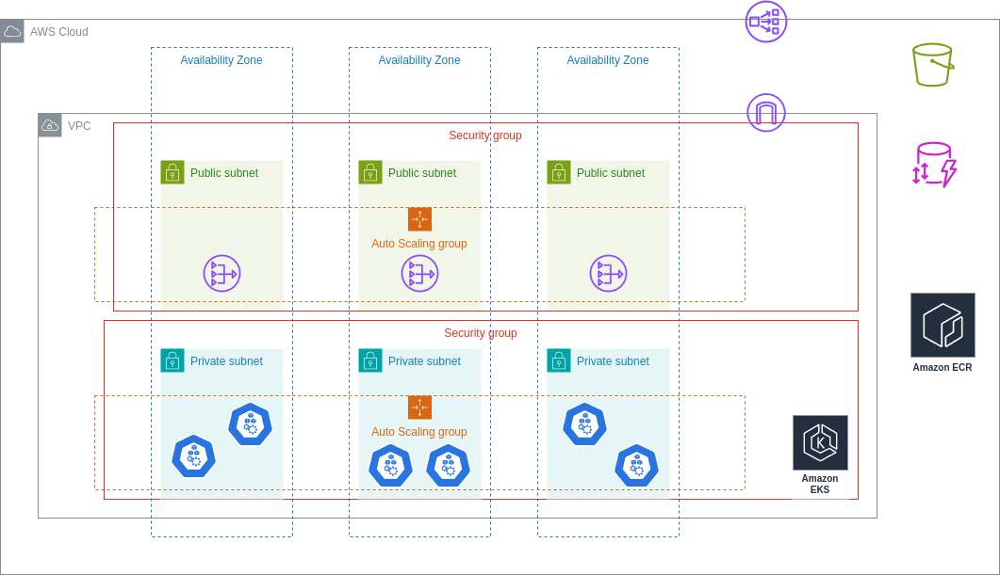
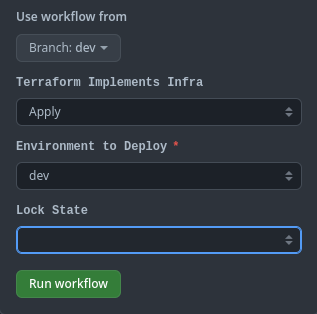
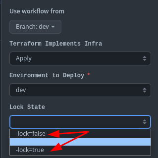
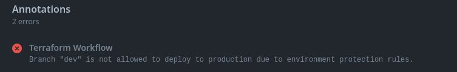
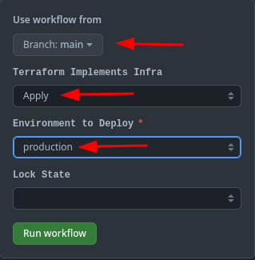
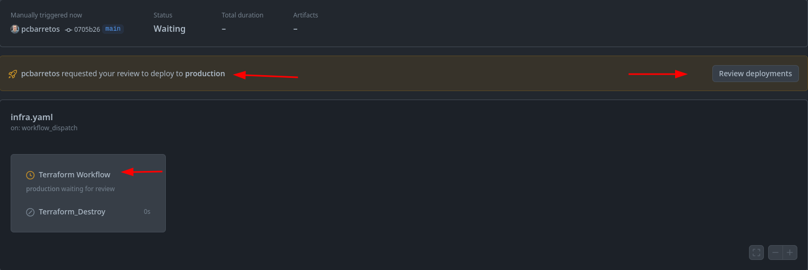
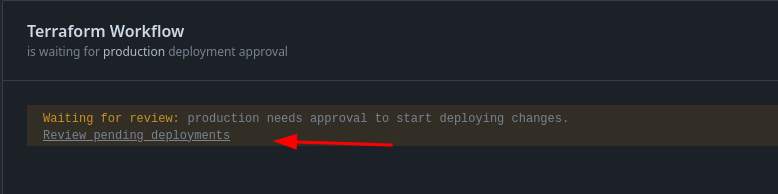
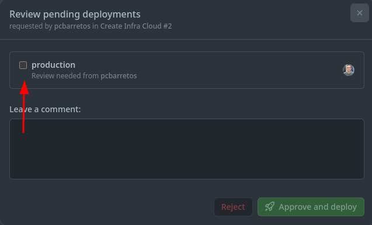

# Challanger
<p align="center">  
	
</p>


Sumário:

- Arquitetura de Infra Proposta
- Arquitetura da Pipeline Infra
- Arquitura da Pipeline da Aplicação
- Pré Requisitos para funcionamento
- Documentação dos Recursos Utilizados

## Arquitetura de Infra Proposta.

<p align="center">  
	
</p>

- Cluster Version: 1.26
- Arquitetura HA com 3 Worker's node divididos em 3 AZ's (Availability Zone)
- Security Group para as Subnets privadas e publicas
- Network Load Balancer para gerenciar o trafego de entrada e saída
- Internet Gateway
- Nat gateway para comunicação entre as subnetes e a internet
- S3 Bucket como Backend terraform
- DynamoDb Table como "LOCK" do Terraform State
- ECR Repositorio para as imagens Docker

## Arquitetura da Pipeline Infra

A Pipeline de Infra consiste em executar a construção da infraestrutura com base em *`environment`* `(Dev, Production)`, onde para o ambiente de dev NÃO ha necessidade de aprovadores para *apply/destroy* apenas para produção ha a necessidade aprovadores tanto para *aplly* quanto para *destroy* da infraestrutura.

Configurações de entrada:

```yaml
  workflow_dispatch:
    inputs: 
      action:
        description: 'Terraform Implements Infra'
        type: choice
        options:
          - Apply
          - Destroy
      environment:
        description: 'Environment to Deploy'
        type: environment
        required: true
      lockState:
        description: 'Lock State' # ou outras opções de CLI
        type: choice
        default: " "
        options:
          - -lock=false
          - " "
          - -lock=true
```

Essas configurações atreladas a Branch rules no repositorio, e a criação das *Environments* no Github visam aumentar a segurança na execução da criação da infraestrutura.

Ex:



Nessa configuração tambem foi previsto possiveis problemas de LOCK por conta do Backend do *tfstate*.
Para esses casos foi adicionado um opção para remover o lock da tabela.



Assim que o a branch e o abiente são selecionados a pipe pode ou não pedir uma aporvação manual *(Produção)*
- Caso a branch seja diferente de main, ou da branch protegida, qualquer deploy em produção casionara em um erro



Caso as opções estejam Ok para *Produção* a pipeline solicitara a aprovação daqueles inclusos nas `Rules Branches Protection`









O mesmo se da para o destroy da infraestrutura para o ambiente de *dev* nao precisa de aprovadores, apenas para *`Production`*


## Pré Requisitos Para Funcionamento
- Create IAM User
  - Usuário com permissões minimas/API 
    - *NAO USAR ROOT_ACCOUNT*
- Adicionar Chaves de Usuário em Secrets do Github
  - `AWS_ACCESS_KEY`
  - `AWS_SECRET_KEY`
  - `AWS_REGION`
- Bucket S3
  - Bucket com Versionamento Ativado
    - Adicionar o nome do Bucket no arquino `terraform.tf linha 38`
- DynamoDB Table
  - Minimas configs LockID type HASH
    - Adicionar o nome databela no arquivo `terraform.tf linha 42`
- Criar duas environments no Github -> *dev*, *production*
  - Doc Git
    - https://docs.github.com/en/actions/deployment/targeting-different-environments/using-environments-for-deployment
- Criar regra de proteção para branch principal *main*, *master* etc, e adicionar os aprovadores.
  - Doc Git
    - https://docs.github.com/en/repositories/configuring-branches-and-merges-in-your-repository/managing-protected-branches/managing-a-branch-protection-rule

## Documentação dos Recursos Utilizados

- *https://github.com/marketplace/actions/hashicorp-setup-terraform/*
- *https://registry.terraform.io/providers/hashicorp/helm/latest/docs/resources/release/*
- *https://registry.terraform.io/providers/hashicorp/aws/5.29.0*
- *https://registry.terraform.io/modules/terraform-aws-modules/eks/aws/19.0.0*
- *https://registry.terraform.io/modules/terraform-module/acm/aws/2.2.0*
- *https://registry.terraform.io/modules/terraform-aws-modules/ecr/aws/1.6.0*